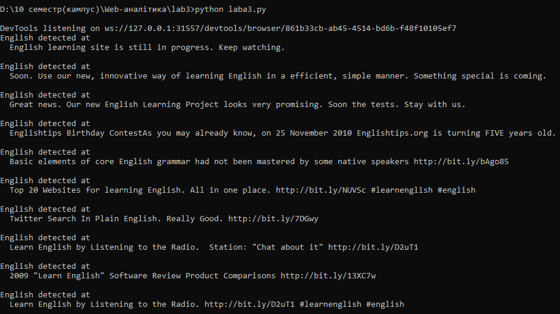

# web_analytics_lab3

*Twitter parser*

Парсинг твітів з використанням *googledriver* та *selenium webdriver*.
Для виконання роботи використовувався **Python 2.7**, а також бібліотеки: **xlrd**, **xlwt**, **urllib2**, **time**, **selenium**, **lxml**, **xlutils**.
А також *googledriver* для *Google Chrome* (файл *chromedriver.exe*).

Обрана сторінка для аналізу: *https://twitter.com/english*

**write_xls(t,d,r,l)** зберігає записи з Twitter у файл *data_3.xls*.

**getURL(url)** зчитує дані з вказаного посилання *url*. Якщо немає доступу, то виводиться повідомлення про помилку.

**alert()** відповідає за виявлення вказаного слова (*English*). Потім активізується *chromedriver.exe*.

**writebook.save('data_3.xls')** виконує зберігання: текст публікації, дату, кількість ретвітів і кількість лайків.

На скріншоті показано результат виконання і відповідні записи, в яких згадується слово *English*.

